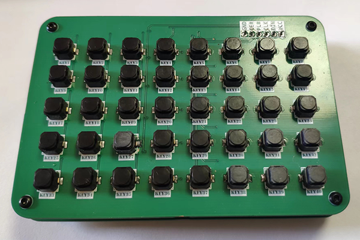
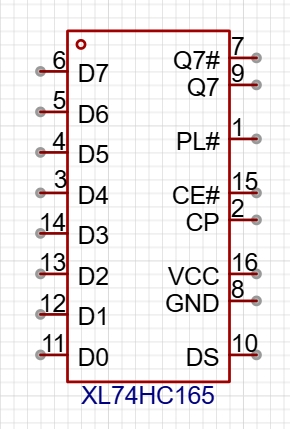

<h1 align="center">MicroPython BLE Keypad</h1>

<p align="center"></p>

## 项目介绍

使用 MicroPython BLE 实现全键无冲蓝牙小键盘。

> 本项目为 [MicroPython New BLE Library](https://gitee.com/walkline/micropython-new-ble-library) 应用示例。

## 获取硬件

访问 [立创开源广场](https://oshwhub.com/walkline/keypad-board) 查看硬件原理图和 PCB。

## 获取代码

本项目将`MicroPython New BLE Library`作为子项目引入，因此在克隆项目时需要执行以下命令：

```bash
git clone --recursive https://gitee.com/walkline/micropython-ble-keypad.git
```

如果是下载的打包文件，或未使用`--recursive`参数克隆项目，则需要执行以下命令补全子模块代码：

```bash
git submodule update --init --recursive
```

## 软硬件架构说明

### 硬件部分

键盘按键采用瀚文键盘的`1*N`矩阵连接方式，利用`74HC165`芯片并行输入串行输出的特性，每个芯片最多可以连接 8 个按键，将多个芯片串联即可实现最多`N*8`键键盘。

本项目中的键盘使用 5 个`74HC165`芯片，连接 40 个静音按键，按键通过电阻进行上拉，未按下时为高电平，按下时为低电平。



### 软件部分：采样按键状态



`74HC165`芯片引脚`D0~D7`分别连接最多 8 个按键，`DS`和`Q7`用于芯片级联。

`PL#`引脚拉低，并行读取按键状态，再拉高引脚，锁存并行数据。

`PL#`引脚拉高，同时`CE#`引脚也处于低电平时，就可以操作`CP`引脚对数据进行移位（串行）输出了。从代码和规格书上看，`CE#`引脚其实可以直接接地。

单片机使用`SPI`读取芯片输出的数据，每读取一次正好可以获取 8 位数据，省去了手动翻转`CP`引脚再读取`Q7`引脚状态的过程，但是需要注意一下`SPI`初始化的状态：

```python
spi = SPI(1)
spi.init(
    polarity=1,
    firstbit=SPI.LSB,
)
```

* `polarity`：设置时钟线空闲时为高电平，否则只能读取到 7 位数据
* `firstbit`：设置读取的字节数据是高位在前还是低位在前，根据数据使用方式进行设置

其它参数采用默认值即可。


### 软件部分：BLE HID 设备

本项目使用 [MicroPython New BLE Library](https://gitee.com/walkline/micropython-new-ble-library) 提供的 [devices/hid/keyboard_2](https://gitee.com/walkline/micropython-new-ble-library/blob/main/devices/hid/keyboard_2/keyboard.py) 实现了蓝牙键盘设备，可以与电脑、手机等中心设备进行配对、绑定、自动重连和收发数据等操作。

### 软件部分：BLE HID 数据

`devices/hid/keyboard_2`使用了全键无冲的`report map`，定义如下：

```python
0x19, 0x04,   # Usage Minimum (0x04)
0x29, 0x65,   # Usage Maximum (0x65)
0x15, 0x00,   # Logical Minimum (0)
0x25, 0x01,   # Logical Maximum (1)
# 0x95, 0x62, # Report Count (98)
0x95, 0x68,   # Report Count (104)
0x75, 0x01,   # Report Size (1)
```

`Report Count (104)`和`Report Size (1)`表示可以一次性发送 104 个数据位，也就是最多 104 个普通按键，`104 / 8 = 13.0`，因此普通按键数据为 13 个字节，再加上修饰符（8 位控制按键）和占位符，所以每次发送的 HID 数据为 15 个字节（`report id`由数据发送函数自动添加）。

> 实际的数据位应为：`0x65 - 0x04 + 1 = 98`，为了 8 位字节对齐所以选择了 104 个数据位。

每次采样完成后的数据如果和上一次结果不一致（说明按键状态发送了变化），这时就需要：

* 遍历所有按键
* 根据`KEY_MAP`的定义获取当前按键键码
* 根据键码获取按键状态
* 在 HID 数据对应键码的位置更新按键状态（0 为按下，1 为抬起）

	> 如果单片机`SPI MISO`引脚连接`74HC165`芯片`Q7#`引脚则可以翻转上述按键状态，也更符合一般直觉。

## 软硬件调试、运行方法

要检查按键焊接质量，可以单独上传`config.py`到开发板，然后在开发板中运行`drivers/_74HC165.py`文件，就可以对所有按键进行直观的检测了。

要完整运行程序可以上传`abconfig`文件中列出的所有文件并复位开发板即可。

> 推荐使用 [AMPY Batch Tool](https://pypi.org/project/ampy-batch-tool) 进行文件上传和运行操作。

## 参考资料

* `ab 工具`安装及使用说明请访问 [AMPY Batch Tool](https://gitee.com/walkline/a-batch-tool) 查看

* [【瀚文】HelloWord-Keyboard](https://oshwhub.com/pengzhihui/b11afae464c54a3e8d0f77e1f92dc7b7)

## 合作交流

* 联系邮箱：<walkline@163.com>
* QQ 交流群：
	* 走线物联：[163271910](https://jq.qq.com/?_wv=1027&k=xtPoHgwL)
	* 扇贝物联：[31324057](https://jq.qq.com/?_wv=1027&k=yp4FrpWh)

<p align="center"></p>
